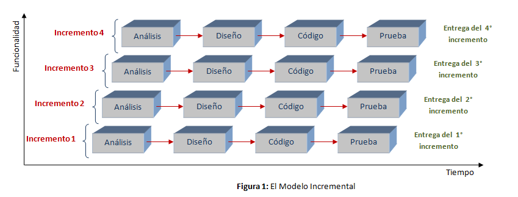
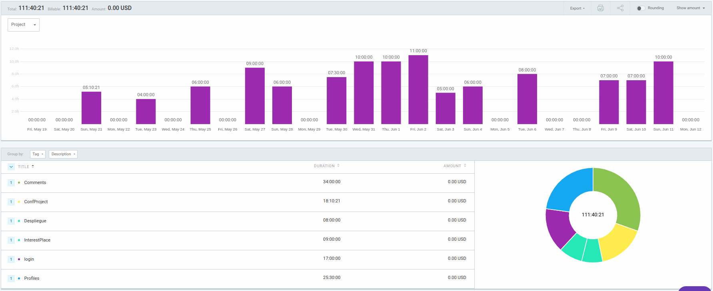

# NoWait-API
API para gestionar la concurrencia en un lugar en tiempo real

# Tabla de Contenidos

- [Introducción](#introducción)
- [Descripción técnica](#descripción-técnica)
    - [Arquitectura de la aplicación](#arquitectura-de-la-aplicación)
    - [Tecnologías utilizadas](#tecnologías-utilizadas)
    - [Componentes](#componentes)
- [Despliegue](#despliegue)
- [Metodología de desarrollo](#metodología-de-desarrollo)
- [Git Flow](#git-flow)
- [Justificación temporal](#justificación-temporal)
- [US no implementadas](#Historias-de-usuario-no-implementadas)
- [Conclusiones](#conclusiones)
    - [Posibles mejoras](#posibles-mejoras)
    - [Principales dificultades](#principales-dificultades)

## Introducción

La idea principal, es crear una red social para compartir información de tiempos de espera a tiempo real, donde cualquier persona (un buen samaritano) puede indicar cuánto cree que hay de espera, cuántas personas hay en el lugar, o la manera en que crea que expresa mejor cuanto tiempo hay de espera.

El objetivo de este proyecto es exponer una API que pueda ser integrada por el proyecto de front [MatiasAGomezJ/nowait-front](https://github.com/MatiasAGomezJ/nowait-front) y sirva para calcular la concurrencia de un lugar en base a los datos que se vayan recogiendo.

# Descripción técnica

**Requisitos funcionales**

- Los usuarios pueden añadir comentarios en una ubicación concreta de información sobre el tiempo de espera y la cantidad de personas que hay en un lugar a través de un elemento cuantificable.
- Los usuarios pueden votar por la precisión y fiabilidad de la información proporcionada por otros usuarios a través de like, dislike y reportar. Si un comentario es reportado más de 3 veces se elimina automáticamente.
- Tanto usuarios como no usuarios pueden ver la concurrencia en el momento actual, el día actual, la semana pasada y por día concreto.
- Los usuarios pueden ser anónimos.
- Los usuarios pueden marcar lugares como favoritos.
- Los usuarios pueden ver y modificar la información proporcionada.

## Arquitectura de la aplicación

Se ha seguido la arquitectura hexagonal con DDD. Eso implica la división del código en capas independientes y desacopladas (inversión de dependencias), cada una con una función específica. Las capas se comunican entre ellas a través de interfaces claramente definidas, así que se puede cambiar una capa sin afectar a las demás.

También se ha seguido el patrón CQRS (Command Query Responsibility Segregation), para separar la lógica de comandos (cómo agregar, actualizar o eliminar datos) y consultas (lectura) en diferentes capas, lo que permite una mayor flexibilidad y escalabilidad. Se usa un componente Handler para atender a los commands y a las querys, lo que hace que se desacoplen los servicios.

## Tecnologías utilizadas

Para desarrollar esta API se ha utilizado:
- **Java17** con **Spring Boot**
- **Gradle** para compilar.
- **MongoDB** como base de datos pero se puede escoger otra.

## Componentes

En la siguiente imagen se puede observar un ejemplo de los componentes que se crean desde un endpoint, como por ejemplo crear un usuario, hasta la conexíon a la base de datos pasando por los diferentes servicios.

El controller se encuentra en la carpeta 'api', luego los servicios como 'CreateUserCommand', 'CreateUserCommandHandler' y 'UserCreator' se encuentrán en la carpeta 'application' del 'core'. En la carpeta 'dominio' se encuentra la clase 'User' y la interfaz 'UserRepository. Y por último, la clase 'MongoDBUserRepository' se encuentra en la carpeta 'infrastructure'.

# Despliegue

Se ha utilizado DigitalOcean para administrar el servidor y el dominio utilizado [nowait.social](http://nowait.social/).

Para ejecutar la API en el servidor de DigitalOcean se ha creado una imagen de Docker (andreusorell/nowait).

# Metodología de desarrollo

Se ha utilizado el **modelo incremental**, en el cual se han ido realizando pequeñas partes del código que han incrementando el proyecto. Por tanto, como se ve en la imagen inferior, cada incremento es, por ejemplo, Análisis, Diseño, Implementación y Prueba de un endpoint.

Además, se ha utilizado Scrum como metodología ‘Agile’ de trabajo para definir sprints y hacer dailies con el compañero encargado de la parte del front que consume esta API. Esto hecho que vayamos más sincronizados con las tareas y que sigamos las mismas reglas de dominio.

# Git flow

El git flow que he seguido es el siguiente:

1. Rama main: Rama principal del proyecto, contiene la versión estable del software.
2. Rama develop: Rama de integración, donde se combinan las características desarrolladas.
3. Ramas de características (feature branches): Ramas separadas para desarrollar nuevas funcionalidades.
4. Merge a develop: Combinar las ramas de características con develop una vez finalizadas.
5. Pruebas y correcciones en develop: Realizar pruebas y solucionar problemas en la rama develop.
6. Merge a main: Fusionar la rama develop en main para tener una versión estable lista para implementar.

# Justificación temporal

Donde he tardado más es en el montaje del proyecto, autenticación y autorización, e implementación de las primeras historias de usuario.

Esto es debido a que he tenido que familiarizarme con Spring Boot (framework que desconocía) junto con el patŕon CQRS y la arquitectura hexagonal que al principio no entendía muy bien como se debía estructurar y conectar los componentes.

Además, en la autenticación y autorización he tardado tanto debido a versiones de dependencias y métodos obsoletos, cosa que ha afectado tambíen en el despliegue ya que he tenido que actualizarlas y modificarlas para poder desplegar la API correctamente.

Una vez familiarizado con lo comentado, la realización de las siguientes historias de usuario se han realizado con el tiempo estimado.

# Historias de usuario no implementadas

Se ha realizado oun 85% de las historias de usuario, las que no se han realizado son las siguientes:
- Creación de distintos tipos de usuarios.
- Un usuario owner (de una empresa) puede tener propiedades y usuarios "staff" asociados.
- Sistema de notificaciones.

# Conclusiones

## Posibles mejoras

Una de las principales mejoras es para la documentación de los endpoints, que se podría utilizar Swagger lo que haría que quede bien indicado lo que se espera y lo que se devuelve.

También, se podría utilizar RabbitMQ para gestionar las peticiones en el caso de que hubiera muchas en poco tiempo.

En el caso de funcionalidad de la aplicación se podría añadir un sistema de colas virtuales para, aparte de conocer la concurrencia, poder hacer cola desde cualquier parte.

Además, se podría crear un sistema de recompensas para los "buenos samaritanos".

## Principales dificultades

La principal dificultad que he tenido ha sido empezar con la base del proyecto que se esta realizando en mi empresa para familiarizarme con lo que voy a trabajar más adelante.

## Conclusión

Una vez aprendido el framework y la arquitectura lo veo muy útil para tener los componentes desacoplados, lo que hace una mayor escalabilidad y que se pueden modificar unos componentes sin afectar a los demás. Además los nombres de los componentes y métodos són muy claros, lo que hace que si un nuevo integrante del equipo quiere meterse en el proyecto pueda entender fácilmente lo que hace cada cosa.

Pero si hubiera sabido lo que tardaría en comprenderlo y que funcionase todo correctamente, habría escogido otras tecnologías ya conocidas y dedicar más tiempo a terminar las historias de usuario y no tanto en configuración y aprendizaje.
